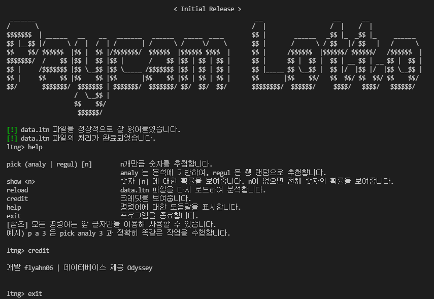

# 페이캄 로또 번호 생성기

간단히 만들어 본 페이캄 로또 번호 생성기입니다. 

# 사용 방법
### 프로그램 사용
`pick (analy | regul) <amount>`   amount개만큼 숫자를 추첨합니다.  
                                analy 는 분석에 기반하여, regul 은 쌩 랜덤으로 추첨합니다. 
`show [n]`                        숫자 n에 대한 확률을 보여줍니다. n이 없으면 전체 숫자의 확률을 보여줍니다. 
`reload`                          data.ltn 파일을 다시 로드하여 분석합니다. 
`credit`                          크레딧을 보여줍니다. 
`help`                            명령어에 대한 도움말을 표시합니다. 
`exit`                            프로그램을 종료합니다. 

모든 명령어는 **앞 글자만을 이용**해 사용할 수 있습니다.  
예시) p a 3 은 pick analy 3 과 정확히 똑같은 작업을 수행합니다.

### main.ltn 수정
\#과 // 은 데이터로 처리되지 않습니다.  
새로운 정보는 스페이스로 구분하여 한 줄당 7개의 숫자를 입력하면 됩니다.

# 버전 히스토리
| 버전 | 버전 이름 | 추가 사항 |
|-----|----------|----------|
| 0.1 | Initial Release | 기본적인 데이터 사용 번호뽑기 구현 |
| 1.0 | 정식 릴리즈 1 | 전체적으로 쉘 형식으로 바꾸고 여러 기능 추가 |
